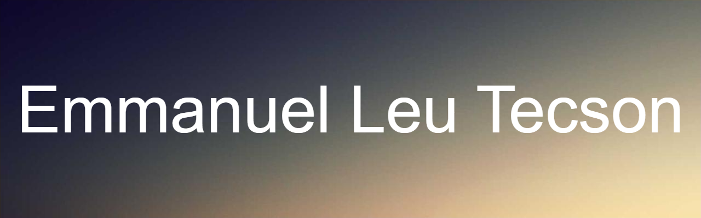

I'm Emmanuel Leu Tecson, currently learning full stack development from [The Odin Project](https://www.theodinproject.com/).
I hope to finish it by April 2025 and start making money from freelancing.
